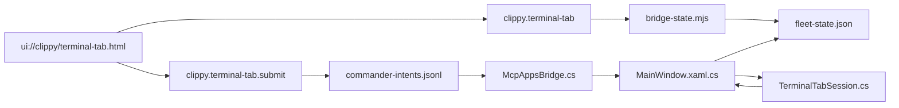

# ADR-004: Dedicated Terminal Tab MCP Apps Contract
## Status: Proposed

## Context

`clippy.terminal-tab` is reserved in the current MCP Apps architecture, but the
repo does not yet have the state, host wiring, or typed intent path needed to
ship it safely.

Current constraints in this repo:

- `widget/WidgetHost/MainWindow.xaml.cs` publishes only coarse tab metadata in
  `BuildFleetSnapshot()`: `tabKey`, `displayName`, `sessionId`, `mode`,
  `agentId`, `modelId`, `groupLabel`, `status`.
- `widget/WidgetHost/TerminalTabSession.cs` exposes only preview fields
  (`LatestPromptPreview`, `LatestTranscriptPreview`, `LatestToolSummary`,
  `LastErrorMessage`). It does not publish a structured per-tab transcript slice
  comparable to `CommanderSession.BuildHistoryEntries()`.
- Widget selection state exists only in WPF (`Tabs.SelectedItem` via
  `ResolveSelectedSession()`); it is not exported to `fleet-state.json`.
- `widget/WidgetHost/MainWindow.xaml.cs` only binds mounted Views for
  `fleet-status`, `commander`, and `agent-catalog`. There is no
  `ui://clippy/terminal-tab.html` binding.
- `widget/WidgetHost/McpAppsBridge.cs` only dispatches `commander.submit`,
  `broadcast.send`, and `linkgroup.*` intents. There is no terminal-tab intent
  family.
- `src/mcp-apps/bridge-state.mjs` can safely merge snapshot slices, but it does
  not yet define a stable terminal-tab contract.

Because of those gaps, shipping a terminal-tab View in the current wave would
either:

1. be cosmetic and stale, or
2. bypass the audited JSONL intent path and mutate tabs directly.

Both outcomes are rejected.

## Decision

Ship terminal-tab as a dedicated MCP Apps family, not as a thin alias over
`clippy.commander.submit`, `clippy.broadcast`, or `clippy.session-inspector`.

The first implementation wave will consist of:

1. `clippy.terminal-tab` — read tool, bound to `ui://clippy/terminal-tab.html`
2. `clippy.terminal-tab.submit` — write tool for prompt submission to one tab

Do not ship raw terminal stdin passthrough, PTY streaming, or arbitrary shell
input in this wave.

Canonical identity for terminal-tab operations is `tabKey`, not `sessionId`.
This follows `CommanderHub`'s real ownership model:

- `TerminalTabSession.TabKey` is the primary unique identity
- `sessionId` is user-visible and useful for debugging, but it is not the
  canonical routing key

`sessionId` may be accepted as a fallback lookup field, but every read result
and every write intent must resolve to and persist the `tabKey`.

## Contract

### 1. Tool surface

#### `clippy.terminal-tab`

Purpose: read the current state of one real terminal tab.

Input:

```json
{
  "tabKey": "guid-optional",
  "sessionId": "string-optional",
  "followSelected": true,
  "historyLimit": 24,
  "includeTranscript": true
}
```

Rules:

- `tabKey` wins over `sessionId` when both are supplied.
- If neither `tabKey` nor `sessionId` is supplied:
  - if `followSelected=true`, the host must resolve the currently selected tab
  - otherwise return `clippy.terminal-tab.target-required`
- `historyLimit` default `24`, max `64`
- `includeTranscript=false` may omit the `transcript.entries` array but must
  still return transcript counters and previews

Output:

```json
{
  "principal": "clippy",
  "commanderSessionId": "cmdr-123",
  "selection": {
    "selectedTabKey": "guid",
    "selectedSessionId": "resume-id",
    "resolvedBy": "selected-tab"
  },
  "host": {
    "widgetConnected": true,
    "mountedResourceUri": "ui://clippy/terminal-tab.html",
    "supportsLiveRefresh": true
  },
  "tab": {
    "tabKey": "guid",
    "sessionId": "resume-id",
    "displayName": "Clippy SWE 2",
    "status": "idle",
    "isReady": true,
    "isSelected": true,
    "waitingForResponse": false,
    "mode": "Agent",
    "agentId": "clippy-swe",
    "modelId": "gpt-5.4",
    "groupLabel": "frontend",
    "latestPrompt": "summarize the failing tests",
    "latestAssistantText": "I found three failures...",
    "latestThoughtText": "",
    "latestPlainText": "I found three failures...",
    "latestToolSummary": "rg, view, npm test",
    "lastError": "",
    "updatedAt": "2026-04-19T18:20:00.000Z"
  },
  "transcript": {
    "historyCount": 14,
    "entries": [
      {
        "role": "User",
        "kind": "message",
        "text": "summarize the failing tests",
        "at": "2026-04-19T18:19:40.000Z"
      },
      {
        "role": "Assistant",
        "kind": "message",
        "text": "I found three failures...",
        "at": "2026-04-19T18:19:55.000Z"
      }
    ]
  },
  "capturedAt": "2026-04-19T18:20:00.000Z"
}
```

Required semantics:

- `tab` is the authoritative state for the resolved target, not a fleet summary.
- `selection` always reflects widget host selection, even when the target was
  resolved explicitly by `tabKey`.
- `latestAssistantText`, `latestThoughtText`, and `latestPlainText` must come
  from the real `TerminalSessionCardSnapshot`, not synthetic placeholders.
- `transcript.entries` must come from a real per-tab history buffer populated
  from Copilot event flow, not reconstructed from preview strings.

#### `clippy.terminal-tab.submit`

Purpose: submit a real prompt to one resolved terminal tab.

Input:

```json
{
  "tabKey": "guid-optional",
  "sessionId": "string-optional",
  "followSelected": true,
  "prompt": "run the targeted test and explain the failure",
  "force": false
}
```

Output:

```json
{
  "accepted": true,
  "intentId": "uuid",
  "tabKey": "guid",
  "sessionId": "resume-id"
}
```

Rules:

- Resolve the target using the same rules as `clippy.terminal-tab`.
- Reject empty prompts.
- Reject unresolved targets with `clippy.terminal-tab.not-found`.
- Reject busy tabs when `force=false` with `clippy.terminal-tab.busy`.
- Append an intent; do not dispatch directly to `TerminalTabSession` from the
  tool handler.

### 2. Intent kinds

Required first-wave mutation intent:

#### `terminaltab.submit`

```json
{
  "id": "uuid",
  "kind": "terminaltab.submit",
  "principal": "clippy",
  "session": "commander-session-id",
  "enqueuedAt": "2026-04-19T18:20:00.000Z",
  "tabKey": "guid",
  "sessionId": "resume-id",
  "prompt": "run the targeted test and explain the failure",
  "force": false
}
```

Rules:

- `session` remains the authoring Commander session.
- `tabKey` is required in the emitted intent.
- `sessionId` is informational and used for logs and diagnostics only.
- Widget dispatch resolves the target by `tabKey`; it may verify `sessionId`
  when present but must not route by `sessionId` alone.

Deferred mutation intents:

- `terminaltab.focus`
- `terminaltab.close`
- `terminaltab.raw-input`

These are explicitly out of first wave because they mutate host chrome or shell
stdin more aggressively than prompt submission.

### 3. Required state shape changes

Do not overload the existing fleet counters into a fake per-tab view. Add a
dedicated terminal-tab slice to the widget-published state.

Required additions:

1. `FleetStateSnapshot` must publish host selection:

```json
{
  "selection": {
    "selectedTabKey": "guid-or-null",
    "selectedSessionId": "string-or-null"
  }
}
```

2. `FleetStateSnapshot` must publish a dedicated terminal-tab detail collection:

```json
{
  "terminalTabs": {
    "list": [
      {
        "tabKey": "guid",
        "sessionId": "resume-id",
        "displayName": "Clippy SWE 2",
        "status": "idle|working|exited|starting",
        "isReady": true,
        "isSelected": false,
        "waitingForResponse": false,
        "mode": "Agent",
        "agentId": "clippy-swe",
        "modelId": "gpt-5.4",
        "groupLabel": "frontend",
        "latestPrompt": "",
        "latestAssistantText": "",
        "latestThoughtText": "",
        "latestPlainText": "",
        "latestToolSummary": "",
        "lastError": "",
        "updatedAt": "ISO8601",
        "historyCount": 0,
        "history": []
      }
    ]
  }
}
```

3. `src/mcp-apps/bridge-state.mjs` must merge and sanitize `selection` and
   `terminalTabs` explicitly, with the same hostile-input protections already
   applied to `tabs`, `groups`, `agents`, and `commander`.

### 4. Host context requirements

Before the View is considered valid, the host must provide:

- currently selected tab identity (`selectedTabKey`, `selectedSessionId`)
- real target tab detail, including transcript slice and waiting state
- live refresh when any of the following changes:
  - selected tab changes
  - target tab `SessionCardUpdated`
  - target tab `CopilotEventReceived`
  - target tab exits
  - mounted resource switches to or from `ui://clippy/terminal-tab.html`

Required widget wiring:

- add `ui://clippy/terminal-tab.html` to `MountedViewBindings`
- re-seed tool results through `PushMountedViewToolResultToViewAsync()`
- ensure `PublishMountedViewRefresh()` runs on tab selection change, not only on
  aggregate state change

### 5. Security and CSP boundaries

Terminal-tab is a stateful control surface, but it still runs inside the same
MCP Apps sandbox:

- CSP stays strict:
  - `default-src 'self'`
  - `style-src 'self' 'unsafe-inline'`
  - `script-src 'self'`
- `connectDomains` and `resourceDomains` remain empty
- no direct PTY handle, no WebSocket, no browser-side fetch to local services
- no arbitrary keystroke passthrough from the View
- all writes go through the JSONL intent log and principal enforcement
- transcript text must be plain-text only; strip ANSI and never render terminal
  output as HTML

### 6. Preconditions before implementation starts

The work is not ready to code until all of the following are accepted:

1. `TerminalTabSession` gets a real history buffer and
   `BuildHistoryEntries(...)`, mirroring the pattern already used by
   `CommanderSession`.
2. `MainWindow.BuildFleetSnapshot()` publishes `selection` and `terminalTabs`.
3. `FleetStateSerializer` and `bridge-state.mjs` are updated with explicit,
   tested schema handling for the new slices.
4. `McpAppsBridge.DispatchIntentLine()` and widget event plumbing add
   `terminaltab.submit`.
5. `server.mjs` registers `clippy.terminal-tab` and
   `clippy.terminal-tab.submit`.
6. `MainWindow.MountedViewBindings` includes `ui://clippy/terminal-tab.html`.
7. Tests exist for:
   - principal rejection
   - target resolution precedence (`tabKey` over `sessionId` over selected tab)
   - busy-tab rejection when `force=false`
   - transcript slice shape
   - mounted-view refresh on selection change

## Consequences

- The terminal-tab surface will be real: it reflects actual selected-tab state,
  real transcript slices, and real prompt dispatch.
- The implementation cost is higher than a cosmetic panel because it requires
  new host-published state and new widget intent dispatch.
- The contract keeps the security model intact by avoiding direct stdin control
  from the browser sandbox.

## Alternatives Considered

### 1. Reuse `clippy.session-inspector` for terminal tabs

Rejected. It is read-only and intentionally generic. It does not define selected
tab behavior, transcript slices, or a typed mutation path.

### 2. Route terminal-tab actions through `clippy.commander.submit`

Rejected. That collapses two different principals of work: Commander reasoning
versus direct tab targeting. It also obscures auditability and target identity.

### 3. Ship a cosmetic View with only the current `tabs.list` fields

Rejected. The user explicitly rejected a fake terminal-tab surface, and the
current fleet snapshot lacks the state needed to make such a View honest.

## Architecture Diagram



## Why this is deferred from the current wave

Terminal-tab is correctly deferred because Commander and Agent Catalog can ship
on the current coarse fleet snapshot, while terminal-tab cannot. It needs:

- selected-tab export from the widget
- per-tab transcript history, not just previews
- mounted-view binding for a new resource
- a new typed `terminaltab.submit` intent family keyed by `tabKey`

Without those pieces, implementation would either be fake or would punch
through the single audited write path.
