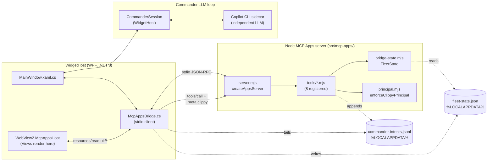

# Windows Clippy MCP Apps: Architecture

Status: v0.2.0 -- first release.

This document describes the Clippy-as-principal architecture introduced in
Windows Clippy MCP v0.2.0, the first release to conform to the MCP Apps
extension (`@modelcontextprotocol/ext-apps` v1.6.0).

See also: [protocol.md](./protocol.md) for the wire format, and
[cookbook.md](./cookbook.md) for how to add a new tool.

## What MCP Apps is

MCP Apps is an extension to the Model Context Protocol that lets a server
return an interactive UI surface (a "View") alongside a tool result. The
host (Claude Desktop, VS Code agent mode, ChatGPT Apps, or our in-widget
`McpAppsHost`) renders the returned `ui://` resource in a sandboxed
WebView and brokers follow-up tool calls back to the server.

Specification and SDK reference:
<https://apps.extensions.modelcontextprotocol.io/api/>

The tools registered by Clippy use `registerAppTool` / `registerAppResource`
from the SDK; both are imported from `@modelcontextprotocol/ext-apps/server`
in `src/mcp-apps/server.mjs`.

## Why Clippy is the principal

Standard MCP deployments treat the user as the principal: the user sits in
front of a chat client, types a prompt, and the client makes tool calls on
the user's behalf. Clippy inverts this.

In Windows Clippy MCP, the principal is **Clippy** -- a long-lived
Commander agent with its own independent LLM loop (driven by a Copilot CLI
sidecar). The human operates a toolbar surface, but Clippy is the entity
that signs tool invocations. Every `tools/call` crossing the bridge is
stamped with:

```json
{ "_meta": { "clippy": { "principal": "clippy", "session": "<sid>" } } }
```

and the server rejects any call missing that assertion (see
`src/mcp-apps/principal.mjs`).

This inversion enables:

- **Autonomous agent UI surfaces.** Clippy can open and populate a View
  (for example, the Commander chat or Fleet Status panel) without the
  human initiating it, because Clippy itself is the authenticated caller.
- **Fleet orchestration.** Clippy controls a fleet of terminal tabs, each
  with its own Copilot CLI session. The Commander reasons across the fleet
  and issues broadcasts, link-group actions, or single-tab delegations.
- **Delegated tool calls on behalf of Clippy.** Any MCP Apps host -- VS
  Code, Claude Desktop, a remote operator -- can drive Clippy's fleet by
  asserting the Clippy principal. The tool handler authorizes the call
  based on the principal claim, not the calling client identity.

## Registered tools

Defined in `src/mcp-apps/server.mjs` (function `createAppsServer`, which
calls each `registerXxx` in `src/mcp-apps/tools/*.mjs`). Current roster:

| Tool                       | Module                                         | Purpose                                                                  |
|----------------------------|------------------------------------------------|--------------------------------------------------------------------------|
| `clippy.fleet-status`      | `src/mcp-apps/tools/fleet-status.mjs`          | Read-only fleet snapshot (tabs, groups, agents, events).                 |
| `clippy.commander.state`   | `src/mcp-apps/tools/commander.mjs`             | Commander session state + recent transcript.                             |
| `clippy.commander.submit`  | `src/mcp-apps/tools/commander.mjs`             | Queue a prompt to Clippy's independent LLM loop.                         |
| `clippy.broadcast`         | `src/mcp-apps/tools/broadcast.mjs`             | Fan a prompt across tabs, a group, or the whole fleet.                   |
| `clippy.link-group`        | `src/mcp-apps/tools/link-group.mjs`            | Manage labeled tab groups (list, link, unlink, broadcast).               |
| `clippy.session-inspector` | `src/mcp-apps/tools/session-inspector.mjs`     | Deep inspect a single entity (commander, tab, group, agent).             |
| `clippy.agent-catalog`     | `src/mcp-apps/tools/agent-catalog.mjs`         | Enumerate bundled + user agents available to Clippy.                     |
| `clippy.telemetry`         | `src/mcp-apps/tools/telemetry.mjs`             | Surface counters, latencies, and the recent-event ring buffer.           |

All eight tools are wrapped through
`wrapToolWithTelemetry(wrapToolWithPrincipal(handler))`; the principal
check runs before the handler body, the telemetry wrapper logs start/end.

Note: a `clippy.terminal-tab` tool is reserved for a future release; in
v0.2.0 terminal-tab interactions are exposed via `clippy.commander.submit`
and `clippy.broadcast`.

## Widget host bridge

The widget (`widget/WidgetHost/`) is a WPF application. It embeds an MCP
Apps **client** that owns a Node subprocess running
`src/mcp-apps/server.mjs`. See `widget/WidgetHost/McpAppsBridge.cs`.

Key mechanics:

- **Transport.** `StdioServerTransport` on the server side; C# owns a
  `Process` with redirected stdin/stdout/stderr. Protocol version string
  is `2026-01-26` (MCP base) plus `ext-apps` v1.6.0.
- **Handshake.** The bridge sends `initialize` with client capabilities
  advertising MCP Apps UI support, then `notifications/initialized`, then
  `tools/list` and `resources/list`.
- **Shared intent log.** Write operations (Commander submit, broadcast,
  link-group mutations) are queued as JSONL lines to
  `%LOCALAPPDATA%\WindowsClippy\commander-intents.jsonl`. Path builder:
  `McpAppsBridge.BuildCommanderIntentsPath()`.
- **Fleet state.** The widget publishes fleet snapshots to
  `%LOCALAPPDATA%\WindowsClippy\fleet-state.json` via
  `McpAppsBridge.PublishFleetStateAsync`; the server reads them lazily
  through `FleetState` in `src/mcp-apps/bridge-state.mjs` (guarded by the
  `CLIPPY_FLEET_STATE_PATH` env var).
- **Intent watcher.** `McpAppsBridge.DispatchIntentLine` tails the
  JSONL, dedupes by `id`, and raises `.NET` events (`CommanderIntentReceived`,
  `BroadcastIntentReceived`, `LinkGroupIntentReceived`) consumed by
  `MainWindow.xaml.cs`.

### Single-write-path invariant

In v0.2.0, **all** in-process submitters (toolbar slash commands, hotkeys,
broadcast shortcuts) must go through `McpAppsBridge.PublishIntentAsync`.
There is no direct `CommanderHub.BroadcastAsync` fallback for slash
commands. This is the fail-closed hardening landed as L4-9.

Rationale: the JSONL log is the single audit trail. If a slash command
short-circuited through an alternate path, it would bypass telemetry,
dedup, and the Clippy-principal stamp. L4-9 removed the last fallback so
every intent is observable and replayable.

## Trust model

- Views run in a Chromium WebView2 instance hosted by the widget.
- The `ui://clippy/<name>.html` scheme is served by the Apps server and
  comes with a strict CSP:
  `default-src 'self'; style-src 'self' 'unsafe-inline'; script-src 'self'`.
- Views are bundled to a single HTML file via `vite-plugin-singlefile`
  (see `src/mcp-apps/views/fleet-status/vite.config.ts`). JS and CSS are
  inlined; no external fetches; `connectDomains` and `resourceDomains` are
  empty by default (`_meta.ui.csp` on every resource registration).
- View-to-server communication flows only through the MCP Apps host
  broker; the View never holds a direct handle to the Node process.

## Architecture diagram



The Commander LLM loop (right-hand side channel) runs independently of
the MCP Apps server. Intents flow into `MainWindow` via bridge events;
`CommanderSession` decides whether Clippy reasons locally, delegates to
a tab, or triggers a fleet action.

## Files touched in v0.2.0

- `src/mcp-apps/server.mjs` -- tool/resource registration.
- `src/mcp-apps/principal.mjs` -- principal enforcement.
- `src/mcp-apps/telemetry.mjs` -- structured logging + counters.
- `src/mcp-apps/bridge-state.mjs` -- fleet snapshot reader.
- `src/mcp-apps/tools/*.mjs` -- 8 tools.
- `widget/WidgetHost/McpAppsBridge.cs` -- C# stdio client + intent bus.
- `src/mcp-apps/views/fleet-status/` -- first React View bundle.

For details on the wire envelope, see [protocol.md](./protocol.md).
