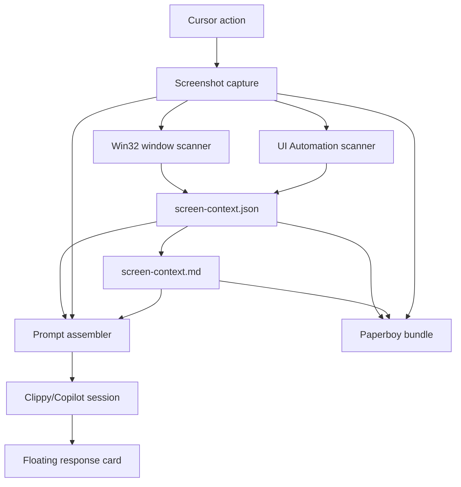

# Darbit Semanifest PRD

## Product name

**Darbit Semanifest** — **D**ecentralized **A**utonomous **R**easoning **B**eyond **I**nitial **T**hought.

## One-line vision

Turn Windows-Clippy-MCP from a screenshot assistant into a semantic understanding system that captures what is on screen, what it means, what can be interacted with, and what an agent should do next.

## Product thesis

A screenshot alone is only pixels. A useful desktop agent needs a **semanifest**: a semantic manifest of the visible desktop state, app/window layers, interactable controls, accessibility/runtime properties, generated visual context, and lineage of decisions taken from that context.

Darbit Semanifest is the runtime layer that produces that manifest, feeds it into Explain/Summarize/Extract/Debug/Accessibility workflows, and stores the resulting evidence as JSON, Markdown, screenshots, and optional `.paperboy.zip` bundles for replay, agent-to-agent handoff, and validation.

## Background

Windows-Clippy-MCP already defines user-facing cursor actions:

- **Explain This**
- **Summarize Screen**
- **Extract Text**
- **Debug UI**
- **Accessibility Check**

The current design can capture screenshots and dispatch screenshot + prompt to the Clippy/Copilot pipeline. That is useful, but insufficient for reliable semantic understanding because visual inference alone lacks the application runtime context.

## Problem statement

The system needs to answer not just “what does this screenshot look like?” but:

- Which applications and windows are visible?
- Which app is foreground?
- What is the z-order/layer stack?
- Which windows are offscreen, minimized, occluded, or overlays?
- Which UI elements are interactable?
- Which controls have names, AutomationIds, values, focusability, invoke/toggle/value patterns?
- Which controls lack accessibility names?
- Which visible controls have suspicious bounds, overlap, or truncation?
- Which objects should be referenced in a prompt, an adaptive card, or an automation step?
- What evidence proves the analysis came from real screen state?

## Goals

1. Generate high-detail semantic context for every screen/cursor action.
2. Produce both machine-readable and human-readable outputs.
3. Support all five primary actions with action-specific semantic contracts.
4. Provide durable lineage from screenshot to context to prompt to response.
5. Enable agent-to-agent handoff through `.paperboy.zip` context bundles.
6. Validate behavior using deterministic local scans and real UI Automation data.
7. Avoid fake responses: every “analysis complete” claim must map to an artifact and validation result.

## Non-goals

- Do not build a cloud-only vision service.
- Do not require Azure or online model calls.
- Do not claim OCR accuracy without an OCR provider.
- Do not replace Playwright or UI Automation; compose with them.
- Do not mutate user windows or click controls during passive scanning.
- Do not infer private data into outbound messages.

## Personas

| Persona | Need |
|---|---|
| Builder | Understand UI state and debug layout/accessibility issues quickly. |
| Commander Agent | Receive structured context for screen-aware reasoning and task routing. |
| SWE Agent | Use runtime UI element inventory to plan safe automation. |
| QA Agent | Validate UI state with evidence, screenshots, and repeatable metadata. |
| Accessibility Reviewer | Identify focus/name/control pattern gaps from UIA data. |
| Paperboy Courier | Bundle screenshot/context/analysis into a tossable artifact. |

## Core concepts

### Semanifest

A **semanifest** is a semantic manifest for a runtime surface.

It contains:

- capture metadata
- screenshot file path and size
- action metadata
- screen dimensions
- cursor coordinates
- visible window stack
- foreground app
- UI Automation element inventory
- interactable controls
- accessibility/focusability properties
- generated analysis contract
- links to Markdown and optional bundle artifacts

### Semanifest lineage

Lineage is the traceable chain:

```text
Action request
→ screenshot capture
→ Win32 layer scan
→ UI Automation scan
→ screen-context.json
→ screen-context.md
→ prompt assembly
→ model/agent response
→ adaptive card output
→ optional paperboy bundle
→ validation evidence
```

### Darbit reasoning

Darbit is not “initial thought.” Darbit is the persistent reasoning loop that can:

1. observe the current runtime state
2. produce evidence
3. reason over that evidence
4. choose next actions
5. hand off context to another agent/tool
6. validate the outcome
7. update the semanifest lineage

## Product surface

### Existing action surface

| Action | Input | Expected semanifest behavior |
---|---|---|
| Explain This | region screenshot | Describe visible region and nearby runtime controls. |
| Summarize Screen | full screenshot | Summarize foreground app, background layers, and task context. |
| Extract Text | region screenshot | Use UIA text/names first, then screenshot/OCR if available. |
| Debug UI | region screenshot | Identify layout, overlap, truncation, disabled controls, z-order issues. |
| Accessibility Check | region screenshot | Identify missing names, focus traps, low semantic value, enabled/focusability gaps. |

### New output surface

Every action should emit:

```text
clippy-<capture-id>.png
clippy-<capture-id>.screen-context.json
clippy-<capture-id>.screen-context.md
optional: clippy-<capture-id>.paperboy.zip
```

## Functional requirements

### FR1. Screenshot capture

The system must capture:

- full screen
- cursor-centered region
- future: specific HWND/window capture

Metadata:

- path
- bytes
- timestamp
- cursor coordinates
- capture mode
- primary display bounds

### FR2. Win32 window enumeration

The scanner must enumerate visible top-level windows.

Fields:

- `zOrder`
- `hwnd`
- `title`
- `className`
- `processId`
- `processName`
- `isForeground`
- `bounds.x`
- `bounds.y`
- `bounds.width`
- `bounds.height`
- `bounds.right`
- `bounds.bottom`
- `visibility`
- future: occlusion estimate

### FR3. UI Automation tree scan

The scanner must capture UI Automation elements with:

- `index`
- `name`
- `automationId`
- `controlType`
- `className`
- `processId`
- `isEnabled`
- `isKeyboardFocusable`
- `isInteractable`
- `patterns[]`
- `bounds`

Supported patterns:

- Invoke
- Value
- Text
- Selection
- SelectionItem
- Scroll
- ExpandCollapse
- Toggle
- RangeValue
- Grid
- Table

### FR4. Interactable inventory

The system must classify an element as interactable when it:

- supports an actionable pattern
- is keyboard focusable
- is enabled and has meaningful bounds

### FR5. Layer model

The context must identify:

- foreground layer
- visible windows in z-order
- desktop/taskbar overlays
- offscreen/minimized candidates
- background visible apps

### FR6. Accessibility profile

For UI Automation elements, generate accessibility signals:

- missing accessible name
- missing AutomationId where relevant
- focusable but unnamed
- clickable but unnamed
- disabled controls visible in workflow path
- tiny or zero-size controls
- text/value controls without readable text

### FR7. Markdown report

Generate a Markdown report with sections:

- capture summary
- foreground layer
- visible window layers
- interactable UI elements
- accessibility concerns
- action-specific analysis contract
- artifact paths

### FR8. JSON schema

Define and version `screen-context.schema.json`.

Minimum top-level shape:

```json
{
  "schema": "https://darbotlabs.github.io/windows-clippy-mcp/screen-context/v1",
  "schemaVersion": "1.0.0",
  "capture": {},
  "action": {},
  "screen": {},
  "windows": [],
  "uiAutomation": {},
  "accessibility": {},
  "lineage": {}
}
```

### FR9. Hosted prompt integration

In widget-hosted mode, attach:

- screenshot PNG
- screen-context JSON
- screen-context Markdown

Prompt must instruct the model to:

- use screenshot for pixels/layout
- use JSON for runtime layers and interactables
- use Markdown for readable context
- avoid inventing controls not present in evidence

### FR10. Standalone fallback

In standalone mode, show:

- screenshot path
- JSON context path
- Markdown context path
- next instructions

### FR11. Paperboy bundle output

Optionally create:

```text
screen-context.paperboy.zip
├── screenshot.png
├── screen-context.json
├── screen-context.md
└── manifest.json
```

### FR12. Action-specific response contracts

#### Explain This

Response must include:

- visible app/region summary
- foreground/nearby layers
- key interactable controls
- likely user intent

#### Summarize Screen

Response must include:

- foreground app
- background context
- visible information summary
- likely next useful action

#### Extract Text

Response must include:

- UIA names/text first
- screenshot/OCR fallback text if available
- grouped hierarchy
- uncertainty markers

#### Debug UI

Response must include:

- layout issues
- z-order/occlusion issues
- truncated/overlapping controls
- disabled or unreachable controls
- suggested fixes

#### Accessibility Check

Response must include:

- missing names
- focusability concerns
- control pattern concerns
- keyboard navigation risks
- WCAG-oriented suggestions

## Non-functional requirements

| Requirement | Target |
---|---|
| Capture latency | < 500ms for screenshot |
| Win32 scan latency | < 200ms |
| UIA scan latency | < 2s for 500 elements |
| Context file size | < 5MB default |
| Privacy | Local files only unless user attaches/shares |
| Reliability | No crash if UIA scan fails |
| Determinism | Same screen state yields comparable JSON shape |
| Extensibility | Schema versioned |

## Architecture



## Data model

### Window layer object

```json
{
  "zOrder": 1,
  "hwnd": 123456,
  "title": "Paperboy",
  "className": "HwndWrapper",
  "processId": 1234,
  "processName": "Paperboy",
  "isForeground": true,
  "bounds": {
    "x": 0,
    "y": 0,
    "width": 1320,
    "height": 820,
    "right": 1320,
    "bottom": 820
  }
}
```

### UI Automation element object

```json
{
  "index": 42,
  "name": "Send",
  "automationId": "WidgetSendButton",
  "controlType": "ControlType.Button",
  "className": "Button",
  "processId": 1234,
  "isEnabled": true,
  "isKeyboardFocusable": true,
  "isInteractable": true,
  "patterns": ["Invoke"],
  "bounds": {
    "x": 100,
    "y": 200,
    "width": 80,
    "height": 32,
    "right": 180,
    "bottom": 232
  }
}
```

## Gamified implementation questline

### Campaign: The Darbit Semanifest

Progression uses XP, badges, and boss gates. A level is complete only when its validation gate passes.

| Level | Quest | XP | Badge |
---|---|---:|---|
| 0 | Name the lineage | 50 | Origin Spark |
| 1 | Capture the screen | 100 | Pixel Scout |
| 2 | Enumerate the window stack | 150 | Layer Ranger |
| 3 | Scan UI Automation tree | 200 | Control Cartographer |
| 4 | Generate JSON semanifest | 200 | Schema Smith |
| 5 | Generate Markdown context | 150 | Lorekeeper |
| 6 | Wire prompt dispatch | 250 | Context Courier |
| 7 | Build adaptive-card response | 150 | Tilewright |
| 8 | Add Paperboy bundle output | 250 | Bundle Squire |
| 9 | Validate action contracts | 300 | Contract Knight |
| 10 | Run full E2E boss fight | 500 | Darbit Awakened |

## Detailed task checklist

### Level 0 — Origin Spark: product skeleton

- [ ] Create PRD/spec document.
- [ ] Define Darbit acronym.
- [ ] Define semanifest and semanifest lineage.
- [ ] Define action surface.
- [ ] Define success criteria.

**Exit gate:** PRD is checked in and reviewable.

### Level 1 — Pixel Scout: screenshot capture

- [ ] Verify full-screen capture.
- [ ] Verify region capture.
- [ ] Save capture under `%APPDATA%\Windows-Clippy-MCP\captures`.
- [ ] Add capture pruning.
- [ ] Record bytes, timestamp, cursor position.

**Exit gate:** capture file exists and metadata records correct dimensions.

### Level 2 — Layer Ranger: Win32 window scanner

- [ ] Add Win32 interop for `EnumWindows`.
- [ ] Capture visible windows.
- [ ] Capture foreground window.
- [ ] Capture HWND, PID, title, class, bounds.
- [ ] Preserve z-order.
- [ ] Add process name lookup.

**Exit gate:** JSON contains foreground window and at least one visible layer.

### Level 3 — Control Cartographer: UI Automation scanner

- [ ] Load UIAutomation assemblies.
- [ ] Traverse descendants.
- [ ] Limit default scan to safe max element count.
- [ ] Capture control type, name, automation ID.
- [ ] Capture bounding rectangle.
- [ ] Capture enabled/focusable flags.
- [ ] Detect supported patterns.
- [ ] Mark interactable elements.

**Exit gate:** JSON contains element count and interactable count.

### Level 4 — Schema Smith: JSON semanifest

- [ ] Define `screen-context.schema.json`.
- [ ] Implement stable top-level shape.
- [ ] Include capture/action/screen/window/uiAutomation/accessibility/lineage.
- [ ] Add schema version.
- [ ] Add validation script.

**Exit gate:** generated JSON validates against schema.

### Level 5 — Lorekeeper: Markdown report

- [ ] Generate Markdown report from JSON object.
- [ ] Include foreground layer.
- [ ] Include visible layer stack.
- [ ] Include interactable controls.
- [ ] Include accessibility concerns.
- [ ] Include action contract.

**Exit gate:** generated Markdown is readable and links to screenshot/JSON.

### Level 6 — Context Courier: prompt dispatch

- [ ] Attach screenshot to hosted cursor prompt.
- [ ] Attach JSON context.
- [ ] Attach Markdown context.
- [ ] Update prompt builder to explain all evidence sources.
- [ ] Preserve existing streaming behavior.
- [ ] Preserve standalone fallback.

**Exit gate:** hosted prompt receives three attachments.

### Level 7 — Tilewright: adaptive-card response

- [ ] Extend cursor-analysis card data schema.
- [ ] Add context JSON path field.
- [ ] Add context Markdown path field.
- [ ] Add window/interactable counts.
- [ ] Render context links/facts.

**Exit gate:** card data includes context paths and counts.

### Level 8 — Bundle Squire: Paperboy package

- [ ] Add optional `.paperboy.zip` output.
- [ ] Include screenshot, JSON, Markdown.
- [ ] Include semanifest lineage manifest.
- [ ] Add "Open Bundle" or "Toss Bundle" affordance.

**Exit gate:** bundle can be unpacked and contains all expected artifacts.

### Level 9 — Contract Knight: action-specific behavior

#### Explain This

- [ ] Use foreground layer.
- [ ] Use region screenshot.
- [ ] Mention top interactables.
- [ ] State likely user intent.

#### Summarize Screen

- [ ] Use full screen.
- [ ] List main apps/layers.
- [ ] Summarize visible content.
- [ ] Suggest next useful action.

#### Extract Text

- [ ] Prefer UIA text/name/value data.
- [ ] Fallback to OCR if provider exists.
- [ ] Preserve visual hierarchy.
- [ ] Mark uncertainty.

#### Debug UI

- [ ] Detect overlap/truncation candidates.
- [ ] Detect offscreen windows.
- [ ] Detect small controls.
- [ ] Detect disabled controls in visible workflow.

#### Accessibility Check

- [ ] Detect focusable unnamed controls.
- [ ] Detect clickable unnamed controls.
- [ ] Detect missing AutomationId where relevant.
- [ ] Detect low semantic richness.

**Exit gate:** all five action outputs contain their required sections.

### Level 10 — Darbit Awakened: E2E boss fight

- [ ] Launch Windows-Clippy-MCP widget.
- [ ] Trigger each action.
- [ ] Verify screenshot exists.
- [ ] Verify JSON exists.
- [ ] Verify Markdown exists.
- [ ] Verify hosted prompt receives all attachments.
- [ ] Verify response card streams.
- [ ] Verify no fake response claims without artifacts.
- [ ] Verify generated files are pruned after retention threshold.

**Exit gate:** E2E report passes all assertions.

## Validation plan

### Unit validation

- JSON schema validation.
- Markdown generation snapshot.
- Win32 scanner returns foreground window.
- UIA scanner returns interactables.
- Accessibility classifier returns expected issues for a mock tree.

### Integration validation

- Capture full screen.
- Capture region.
- Generate context files.
- Dispatch to hosted prompt.
- Render floating card.
- Copy/open generated artifacts.

### Manual validation

For each action:

1. Put a known app in foreground.
2. Trigger action.
3. Confirm screenshot includes app.
4. Confirm JSON foreground matches app.
5. Confirm Markdown mentions app.
6. Confirm response references real UI elements.

### No-fake-response validation

A response is invalid if:

- screenshot missing
- JSON missing
- Markdown missing
- foreground app absent
- interactable count absent
- model claims controls not present in JSON or screenshot

## Acceptance criteria

| ID | Criterion |
---|---|
| AC-001 | Every cursor action emits screenshot + JSON + Markdown. |
| AC-002 | JSON includes foreground window, window stack, and UIA element inventory. |
| AC-003 | Markdown includes visible windows and interactable controls. |
| AC-004 | Hosted prompts attach screenshot + JSON + Markdown. |
| AC-005 | Explain/Summarize/Extract/Debug/Accessibility actions each use action-specific prompt contracts. |
| AC-006 | Standalone mode shows paths to all generated artifacts. |
| AC-007 | Context generation failure does not crash cursor capture. |
| AC-008 | E2E validation proves artifacts exist before response is marked complete. |

## Risks and mitigations

| Risk | Mitigation |
---|---|
| UI Automation traversal is slow | Cap element count; add per-process/window filters. |
| Some apps expose poor UIA data | Combine screenshot, Win32, and optional OCR. |
| Offscreen windows pollute stack | Mark offscreen/minimized candidates separately. |
| Sensitive screen data captured | Keep artifacts local; prune old captures; do not auto-share. |
| Model hallucinates controls | Prompt requires referencing JSON/screenshot evidence. |
| Large JSON attachments | Limit default elements; support compact mode. |

## Future expansions

- OCR provider integration.
- Per-window capture mode.
- Occlusion calculation.
- Semantic UI element stable IDs.
- Playwright/WinAppDriver bridge for actionable automation.
- Paperboy context bundles.
- Dayourbot/DLM-Lib orchestration handoff.
- Timeline explorer for semanifest lineage.

## Current implementation status

As of this PRD, the first implementation pass has already added:

- screenshot capture
- Win32 visible window scanning
- UI Automation element scanning
- JSON context generation
- Markdown context generation
- hosted prompt attachment wiring
- adaptive-card schema fields for context paths
- formal `screen-context.schema.json`
- Paperboy `.paperboy.zip` context bundles
- card deck game launcher and grading harness

Remaining production hardening:

- accessibility classifier
- OCR provider
- action-by-action validation harness
- E2E test runner

## Card deck game launcher

The Darbit questline is also represented as a local **card deck** (`cd`) that can be completed into a reviewed **card deck game** (`cdg`).

Launcher:

```text
widget\Launch-DarbitCardDeckGame.cmd
```

Default card deck:

```text
widget\adaptive-cards\darbit-agent-card-deck.json
```

The launcher reads the deck, evaluates each quest against repo artifacts, writes `cd` and `cdg` JSON files under `%APPDATA%\Windows-Clippy-MCP\darbit-card-deck-game`, produces a Markdown review, and assigns a grade from earned XP. This makes the game auditable: a quest only passes when its checks find actual implementation evidence.

